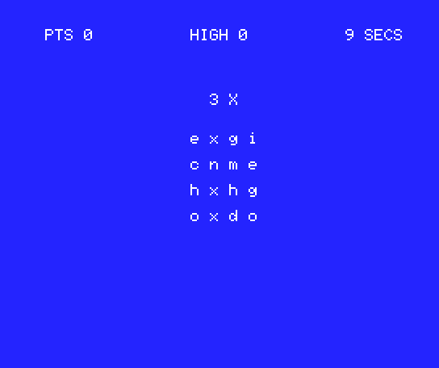

# PazBAS
PazBAS is a simple mnemonic puzzle game in 10 lines of BASIC MSX.



# Game Logic
Player must find the character that repeats X times in the matrix.

Above the letters matrix there is the hint message for the character to guess:
- 1X: indicates a character that appears once
- 2X: indicates a character that appears twice
- 3X: indicates a character that appears three times

The time is limited to 10 seconds, a new matrix is presented when it expires.

If you guess the character the remaining time is added to the score otherwise subtracted.

Sources are stored at: https://github.com/robertocapuano/PazBAS

# Installation
Game was developed on a MSX2 emulator at https://webmsx.org/
1. connect to https://webmsx.org/
2. click on the first floppy icon below the blue screen
3. Select "Add Disk Images"
4. Choose "paz.dsk"
5. type in:
```
load "a:paz.bas"
run
```
otherwise
1. connect to https://webmsx.org/
2. press ALT+B
3. copy and paste source code
5. type in:
```
run
```

# Source Description

```
1 screen0:DIMS$(16):R=RND(-TIME):E=0:KEYOFF:ONINTERVAL=50GOSUB10
```
- initialize Random Number Generator
- initialize E (timer) to zero
- start the timer call-back subroutine


```
2 CLS:?P"PTS":R=RND(1):L=25*R:IF R>(1-R) THEN M=0:N=L-1:ELSE M=L+1:N=25
```
- clear screen
- print points
- generate the letter index to guess: L
- select the wider intervall between: 0-L and L-25


```
3 FORI=0TO15:R=RND(1):S$(I)=CHR$(97+R*(N-M)+M):NEXTI:A$=CHR$(97+L):T%=RND(1)*3+1
```
- generate random matrix and store it into the array S$()
- the random matrix doesn't contains the choosen character
- A$ contains the character to guess
- T% contains the number of times that character must appaer

```
4 K%=0:FORI=0TOT%-1:K%=K%+RND(1)*4+1:S$(K%)=A$:NEXT:C=0:FORI=0TO3:FORJ=0TO3
```

- For T% times, at random position, A$ is is inserted into the matrix 


```
5 LOCATE15+I*2,8+J*2:?S$(I*4+J):NEXTJ,I:LOCATE16,5:?T%"X":E=10:INTERVALON:
```
- Random Matrix is printed on the screen.
- Hint is shown
- Time E is resetted to 10 seconds.

```
6 K$=INKEY$:ifE=0then2:ELSEifK$<"a"orK$>"z"then6elseINTERVALOFF:locate19,16:?K$
```

- event callback is turned on
- a char is read from the keyboard
- if time is over level is restarted
- checks if the character pressed is valid
- event interval callback is turned off to avoid interference with the print

```
7 FORI=0TO15:ifS$(I)=K$THENC=C+1:next:elsenext
```
- compute the number of times that KR$ appaers into the matrix: it could be
different from A$ but be a valid solution.


```
8 FORI=0TO3:FORJ=0TO3:LOCATE15+I*2,8+J*2:K=I*4+J:ifS$(K)=K$then?K$:else?" "
```
- show on the matrix the character selected

```
9 NEXTJ,I:locate16,16:?C:forI=0to1000:next:IFC=T%thenP=P+E:GOTO2:elseP=P-E:goto2
```
- if character pressed is present T% times into the matrix points P% is incremented, 
else subtracted
- in any case level is repeated

```
10 IF E=0 THEN RETURN:ELSE E=E-1:LOCATE28,0:? E"SECS":RETURN
```
- event callback: it decrease time and show it on the screen.

