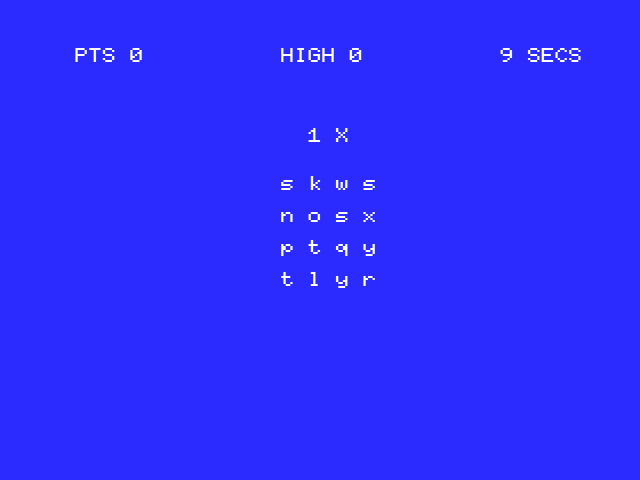

# PazBAS
PazBAS is a simple mnemonic puzzle game in 10 lines of BASIC MSX.



# Game Logic
Player must find the character that repeats X times in the matrix.

Above the letters matrix there is the hint message for the character to guess:
- 1X: indicates a character that appears once
- 2X: indicates a character that appears twice
- 3X: indicates a character that appears three times

The time is limited to 10 seconds, a new matrix is presented when it expires.

If you guess the character the remaining time is added to the score otherwise subtracted.

Sources are stored at: https://github.com/robertocapuano/PazBAS

# Installation
Game was developed on a MSX2 emulator at https://webmsx.org/
1. connect to https://webmsx.org/
2. click on the first floppy icon below the blue screen
3. Select "Add Disk Images"
4. Choose "paz.dsk"
5. type in:
```
load "a:paz.bas"
run
```

# Source Description

```
1 P%=0:DIM S$(16):R=RND(-TIME):TM%=0:KEY OFF:ON INTERVAL=50 GOSUB 10
```
- initialize P% (player points) to zero
- initialize Random Number Generator
- initialize TM% (timer) to zero
- start the timer call-back subroutine


```
2 CLS:PRINT P%"PTS":R=RND(1):L=25*R:IF R>(1-R) THEN M=0:N=L-1:ELSE M=L+1:N=25
```
- clear screen
- print points
- generate the letter index to guess: L
- select the wider intervall between: 0-L and L-25


```
3 FOR I%=0 TO 15:R=RND(1):S$(I%) = CHR$(97+R*(N-M)+M): NEXT I%:K%=0
```
- generate random matrix and store it into the array S$()
- the random matrix doesn't contains the choosen character


```
4 A$=CHR$(97+L):T%=RND(1)*3+1:FOR I%=0 TO T%-1:K%=K%+RND(1)*4+1:S$(K%)=A$:NEXT
```
- A$ contains the character to guess
- T% contains the number of times that character must appaer
- For T% times, at random position, A$ is is inserted into the matrix 


```
5 FOR I%=0TO3:FOR J%=0 TO 3:LOCATE15+(I%*2),8+(J%*2): PRINT S$(I%*4+j%)
```
- Random Matrix is printed on the screen.


```
6 NEXT J%:NEXT I%:LOCATE16,5:PRINT T%"X":TM%=10:INTERVAL ON: rem PRINT A$
```
- Hint is shown
- Time TM% is resetted to 10 seconds.
- event callback is turned on
- in case of debug a commented print is present to show the character to guess


```
7 KR$=INKEY$:if TM%=0 then 2:ELSE if KR$="" OR KR$<"a" OR KR$>"z" then 7
```
- a char is read from the keyboard
- if time is over level is restarted
- checks if the character pressed is valid


```
8 INTERVAL STOP:LOCATE10,15:PRINT A$:C%=0:FORI%=0TO15:if S$(I%)=KR$THENC%=C%+1
```
- event interval callback is turned off to avoid interference with the print
- the character to guess is shown
- is computed the number of times that KR$ appaers into the matrix: it could be
different from A$ but be a valid solution.

```
9 NEXT:BEEP:IF C%=T%then P%=P%+TM%:GOTO2:else P%=P%-TM%:goto2
```
- if character pressed is present T% times into the matrix points P% is incremented, 
else subtracted
- in any case level is repeated

```
10 IF TM%=0 THEN RETURN:ELSE TM%=TM%-1:LOCATE 28,0:PRINT TM%"SECS":RETURN
```
- event callback: it decrease time and show it on the screen.

